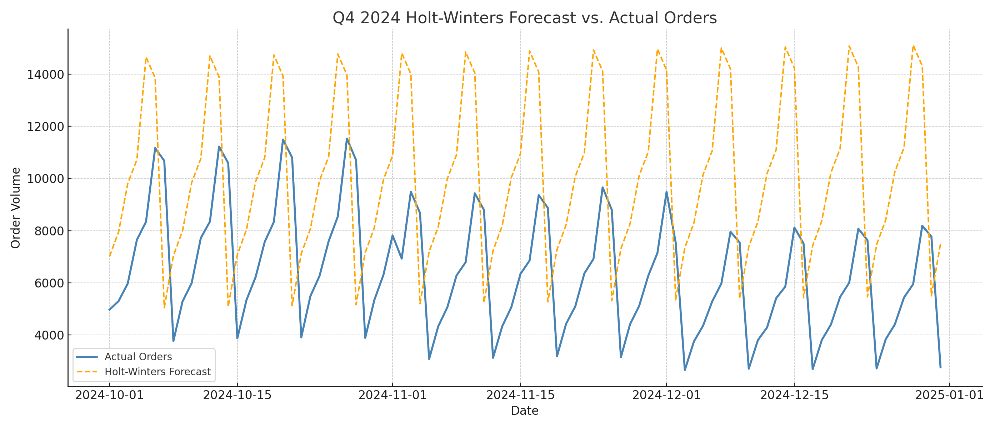
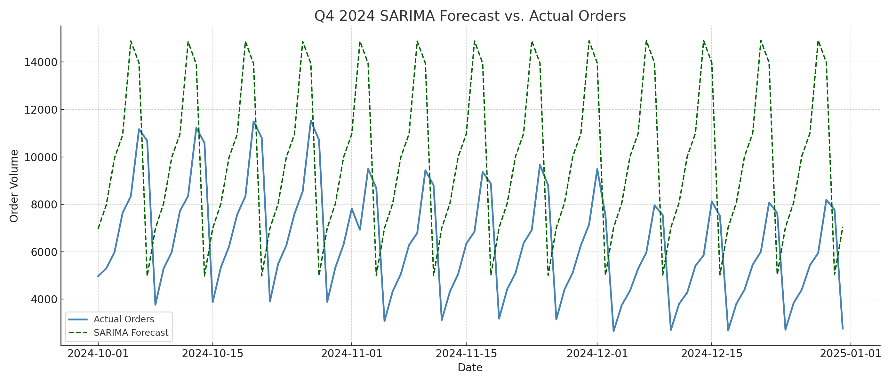

# Forecasting-q4-2024
Forecasting Q4 2024 daily order volume using Holt-Winters and SARIMA

## 🔎 Methodology

1. **Data Preparation**
   - Loaded historical daily order data from 2022 through 9/30/2024
   - Cleaned and formatted the dataset for modeling

2. **Modeling**
   - Fitted Holt-Winters and SARIMA models on training data
   - Forecasted 92 days into the future (Oct 1 – Dec 31, 2024)

3. **Evaluation**
   - Compared forecasts against actuals using MAE and RMSE

---

## 📈 Forecast Accuracy

| Model         | MAE   | RMSE  |
|---------------|--------|--------|
| Holt-Winters  | 4,653  | 4,966  |
| SARIMA        | 4,610  | 4,906  |

- Both models captured seasonal trends
- SARIMA slightly outperformed Holt-Winters
- Neither model fully captured peak-day spikes (possible for future improvement with feature engineering or machine learning)

---

## 📊 Visuals

  
*Holt-Winters vs Actual Orders – Q4 2024*

  
*SARIMA vs Actual Orders – Q4 2024*

---

## 📌 Takeaways
- Classical time series models can provide strong seasonal baselines
- SARIMA is slightly more flexible for weekly seasonality in retail-like demand
- Real-world event spikes remain a challenge for statistical models

---

## 🚀 Author
**Samuel Fairley**  
[LinkedIn](https://www.linkedin.com/in/samuelfairley) | [GitHub](https://github.com/scfairle)
